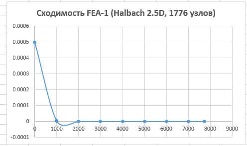
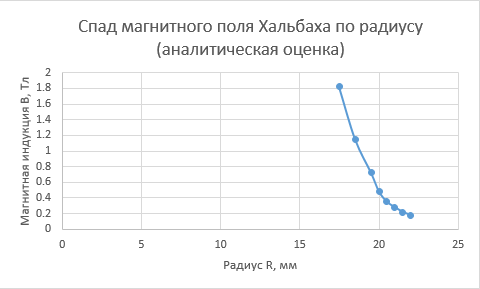
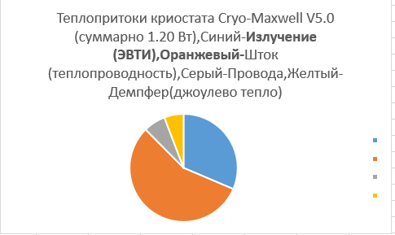
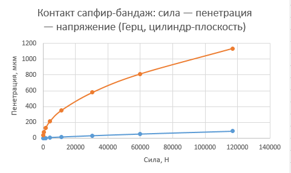
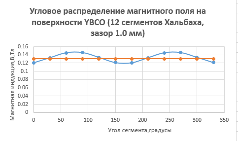

[](https://www.gnu.org/licenses/gpl-3.0)
[]()
[]()
[]()
[]()
[]()
[]()
[]()
[]()
[]()
[]()

FAQ
<details> <summary><b>Why 40 K? Can't it be warmer?</b></summary>
YBCO transitions to the superconducting state at 92 K. But the pinning force increases with decreasing temperature. At 77 K (liquid nitrogen) the pinning force is ~5 N/cm² — too low. At 40 K — 15 N/cm². A compromise between the cooling capacity of the cryocooler and the holding force.

</details><details> <summary><b>Is it possible without a cryocooler? Pour in liquid nitrogen and ride?</b></summary>
It is possible, but the pinning force will drop threefold (from 2016 N to ~670 N). The drop without breakthrough will decrease from 4.5 m to ~1.5 m. For trail — ok. For DH — no.

</details><details> <summary><b>What happens if the power goes out?</b></summary>
YBCO heats up, superconductivity disappears, the magnet rests on the sapphire bushings. The fork becomes rigid but controllable. After power is restored — levitation again.

</details><details> <summary><b>What happens during a breakthrough? Is it dangerous?</b></summary>
On a drop >5 m, the magnetic cushion breaks through. The shaft hits the sapphire bushings. The sapphire may crack. YBCO may crack. The fork requires overhaul. For a person, the drop height itself is more dangerous than the fork failure.

</details><details> <summary><b>Why isn't it used in cycling?</b></summary>
Mass (4.5 kg vs 2.5 kg for Fox 40), startup time (15 min), power consumption (50 W), price (~$15k). For DH racing — uncompetitive. For space, cryogenic equipment, precision vibration isolation — optimal.

</details><details> <summary><b>What is the service life? When to replace?</b></summary>
The service life of the levitation unit is unlimited (no contact wear). Inconel 718 bellows — replacement at 70,000 cycles. Sapphire bushings — replacement upon cracks (inspection every 10,000 cycles). Cryocooler — service life ~10,000 hours (replacement every 3–5 years).

</details><details> <summary><b>Can it be 3D printed?</b></summary>
STL files are ready. But for operation, you need a cryocooler, YBCO tiles, N55 magnets, sapphire bushings, a vacuum port. 3D printing — only for visualization and assembly fit check. Also, a textual drawing is provided. Working with the STL model with an accompanying textual drawing (PMI).

</details>

## Quick Start (C++ Compilation)

Instructions for building and running the simulation, thermal balance, and numerical solver modules from the `src` folder.

### Requirements
Compilation requires a compiler supporting at least the C++11 standard (GCC or Clang recommended):
* **Linux:** `sudo apt install build-essential`
* **macOS:** `xcode-select --install`
* **Windows:** Install [Visual Studio](https://microsoft.com) with the "Desktop development with C++" component.

### Build and Run

1. **Clone the repository and navigate to the source code folder:**
   ```bash
   git clone https://github.com
   cd cryo-maxwell/src
Compile the required executable:

Main fork generator:

bash
g++ -O3 CRYO-MAXWELL.cpp -o cryo_maxwell
Thermal balance simulation (cryocooler/YBCO):

bash
g++ -O3 thermal_balance.cpp -o thermal_balance
Numerical solver:

bash
g++ -O3 xim_solv.cpp -o xim_solv
Magnetic field calculation (Halbach FEA):

bash
g++ -O3 fea_halbach_magnetostatic.cpp -o fea_magnetostatic
Sapphire bushing strength/impact calculation:

bash
g++ -O3 fea_sapphire_impact.cpp -o fea_impact
Version without assembly (No Assembly):

bash
g++ -O3 cryo-maxwellnoassembly.cpp -o cryo_no_assembly
(The -O3 flag enables code optimization, critically important for heavy mathematical computations).

Run the compiled application:

   ## Convergence Plots and Simulation Results (FEA)

The results of numerical modeling and calculation convergence plots are available in the `docs` folder:

| Study | Convergence Plot |
| :--- | :--- |
| **General FEA Convergence** | [](docs/convergence_FEA.png) |
| **Magnetic System (Halbach)** | [](docs/convergence_halbah.png) |
| **Heat Gain** | [](docs/convergence_heat_gain.png) |
| **Impact Loads** | [](docs/convergence_impact.png) |
| **Superconductor (YBCO)** | [](docs/convergence_ybco.png) |

*Click on any plot to open it in its original resolution.*


   # ❄️ CRYO-MAXWELL V5.0

**Fork shock absorber based on quantum pinning with active energy recuperation**

[](https://www.gnu.org/licenses/gpl-3.0)
[]()
[]()
[]()
[]()

---

## ABOUT THE PROJECT

Cryo-Maxwell is an inverted telescopic fork in which the shaft does not touch the walls. It levitates in the magnetic field of superconducting YBCO tiles at 40 K. There is no friction. Upon impact, eddy currents in copper coils brake the shaft and return up to 70% of the energy to a supercapacitor.

The project is calculated from magnetostatics to chemical compatibility. Geometry is generated by C++ code, control electronics are described in Verilog, documentation complies with ESKD.

---

## TECHNICAL SPECIFICATIONS

| Parameter | Value |
|:---|:---|
| Type | Inverted telescopic, Stirling cryogenic cycle |
| Principle | Quantum pinning YBCO + eddy-current damper |
| Stroke | 120 mm |
| Pinning force (Halbach) | 2,016 N |
| Maximum drop (without breakthrough) | 4.5 m |
| Friction | 0 N (levitation) |
| Operating temperature | 40 K (−233°C) |
| Time to operating mode | ~15 min |
| Mass | ~4.5 kg |
| Power consumption | ~50 W |
| Recuperation | up to 70% |

---

## REPOSITORY CONTENTS

```text
.
├── cad/           # Drawings and PMI in KOMPAS-3D
├── docs/          # Documentation, specifications, and FEA convergence plots
├── hdl/           # FPGA controller source code (Verilog/RTL)
├── src/           # Main C++ modules, FEA solvers, and thermal balance
├── LICENSE        # Project license (GPL v3)
└── README.md      # Project documentation
HOW IT WORKS
A Stirling cryocooler (2 W @ 40 K) cools 16 single-domain YBCO tiles. A magnetic assembly of 12 NdFeB N55 segments (Halbach cylinder, Br = 1.45 T) levitates in the field of the tiles with a gap of 1.0 mm. Holding force — 2,016 N.

On compression, an eddy-current damper (3 phases, 3×0.3 mm tape, Artix-7 FPGA, 250 kHz) short-circuits the coils, creating braking torque. On rebound, energy is rectified into a supercapacitor.

Two sapphire bushings (leucosapphire, Ra ≤ 0.02 µm) in beryllium bronze cages secure the shaft in case of magnetic cushion breakthrough. An Inconel 718 bellows (12 convolutions) seals the cryostat.

CALCULATION RESULTS
Magnetostatics (FEA 2.5D): B_max = 1.64 T, B_ybco ≈ 0.20 T, dB/dr = 149 T/m, uniformity ±10%.

Sapphire-bandage contact (Hertz): at a standard drop of 3.5 m — stresses 0 MPa (no contact). At 5.0+ m breakthrough — stresses exceed 400 MPa, sapphire cracks.

Thermal balance: total heat gain 1.20 W with a cryocooler cooling capacity of 2.00 W. Margin 40%.

Chemistry: oxygen safety confirmed (0.0001 J), Au-In intermetallics stable, hydrogen embrittlement below threshold, no galvanic corrosion.

LICENSE
GNU General Public License v3.0. Commercial use — only with the written consent of the author.

Copyright © Roman Chernyaev. [amerkj999@gmail.com]


